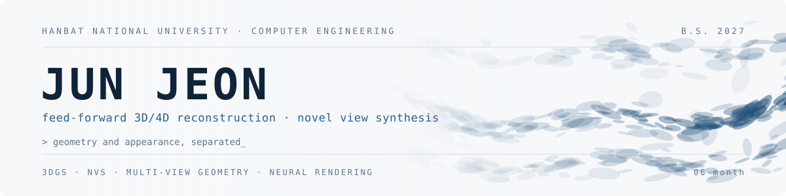

  <picture>
    <source media="(prefers-color-scheme: dark)" srcset="assets/banner-dark.svg">
    
  </picture>

  
  
  
  

I work on **feed-forward 3D/4D scene reconstruction** — recovering geometry and appearance from
unposed multi-view or monocular video in a single pass, without per-scene optimization.
Most of my attention goes to **dynamic Gaussian representations**, **motion modeling**, and
**efficient neural rendering**.

Fourth-year undergraduate at **Hanbat National University**, graduating Feb. 2027.
Previously an undergraduate researcher at **UNIST Vision & Learning Lab** (3D hand pose)
and **AiRLab** (segmentation, representation learning). Everything on the 3DGS side is self-taught.

---

## Currently

| ID | TRACK | STATE |
| :--- | :--- | :--- |
| `RSCH-01` | Feed-forward 3D/4D reconstruction — compact query-based and dynamic Gaussian methods | literature study &middot; proposal |
| `ENGR-01` | On-device human pose estimation for real-time exercise posture assessment | capstone |

Reading in depth: `3DGS` · `Deformable 3DGS` · `VGGT` · `C3G` / `C4G`

---

## Education

| Institution | Program | Period |
| :--- | :--- | :--- |
| **Hanbat National University** | B.S. Computer Engineering | Mar. 2025 – Present |
| **Pai Chai University** | B.S. Coursework, Software Engineering | Mar. 2021 – Dec. 2022 |

## Research experience

| Lab | Focus | Period |
| :--- | :--- | :--- |
| **UNIST Vision & Learning Lab (UVLL)**  Advisor: Prof. Seungryul Baek | 3D hand pose estimation and 3D hand reconstruction | Mar. – Jun. 2026 |
| **AiRLab**, Hanbat National University  Advisor: Prof. Dong-Geol Choi | Computer vision, image classification, semantic segmentation | Jun. 2025 – Mar. 2026 |

---

## Selected work

| Repository | What it is | Stack |
| :--- | :--- | :--- |
| [**CLIP2FL_BKD**](https://github.com/06-month/CLIP2FL_BKD) | Balanced knowledge distillation on top of CLIP2FL for long-tail federated learning. Became a KICS 2026 paper | PyTorch |
| [**Satellite-Cloud-Semantic-Segmentation**](https://github.com/06-month/Satellite-Cloud-Semantic-Segmentation) | Three-class cloud segmentation from satellite imagery — thick cloud, thin cloud, cloud shadow | PyTorch, OpenCV |
| [**satellite-building-segmentation**](https://github.com/06-month/satellite-building-segmentation) | Building-footprint segmentation from aerial imagery | PyTorch |
| [**Offline-to-Online-RL**](https://github.com/06-month/Offline-to-Online-Reinforcement-Learning) | Online fine-tuning of offline-pretrained RL policies | PyTorch |
| [**Budgetly**](https://github.com/06-month/HBNU-SWUNIV-ossw-competition25-yee) | OCR-based personal finance web app. 1st place, HBNU Open Source Software Utilization Competition 2025 | Python, OCR |

---

## Publication

**Balanced Knowledge Distillation (BKD) for Long-Tail Federated Learning Based on CLIP2FL**
<samp>Jun Jeon</samp>, Minu Baek, Sangkeum Lee† — *KICS Winter Conference, 2026*

---

## Notes

I keep a linked research notebook — 135+ notes on 3D representation, rendering, and the geometry
behind them, written as I read rather than after.

[3D Gaussian Splatting](https://archive-06.vercel.app/wiki/3d-gaussian-splatting) ·
[NeRF](https://archive-06.vercel.app/wiki/nerf) ·
[4D Scaffold-GS](https://archive-06.vercel.app/wiki/4d-scaffold-gs) ·
[MoSca](https://archive-06.vercel.app/wiki/mosca) ·
[ATSplat](https://archive-06.vercel.app/wiki/atsplat) ·
[**all notes →**](https://archive-06.vercel.app/wiki-map)

---

## Stack

  
  
  
  
   
  
  
  
  
  
   
  
  
  
  

Working knowledge: 3D Gaussian Splatting · novel view synthesis · multi-view and camera geometry · COLMAP · semantic segmentation

AWS Certified Cloud Practitioner (CLF-C02) · Naver Cloud Platform Certified Associate (NCA) · TOEIC 800

---

  <picture>
    <source media="(prefers-color-scheme: dark)" srcset="https://raw.githubusercontent.com/06-month/06-month/output/snake-dark.svg">
    <source media="(prefers-color-scheme: light)" srcset="https://raw.githubusercontent.com/06-month/06-month/output/snake.svg">
    
  </picture>

